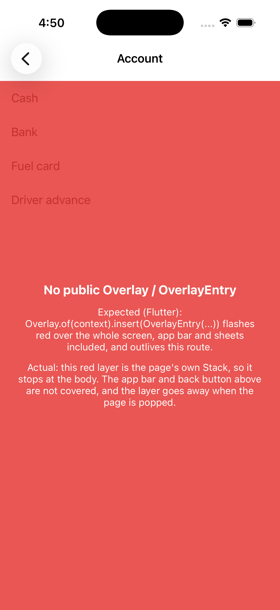

# Repro: no public Overlay / OverlayEntry

Issue: https://github.com/DartNative/dartnative/issues/67

There is no public `Overlay` / `OverlayEntry` in DartNative 1.0.0, so an app can't put a layer above the current route: above the app bar, above a presented sheet, and outliving a page that pops. Our use case is a full-screen red flash when an account is deleted (the page pops while the flash fades), and app-styled banners/toasts that stay above route changes.

## Run

`dn run` (iOS simulator; Android behaves the same unless stated).

## What you'll see

The app pushes an "Account" page on start (tap **Delete account** to push it again). The page draws a red layer with a `Stack` + `Positioned.fill` in its own body, which is the closest thing available.

- The red layer stops at the body: the app bar, its title and the back button are not covered.
- Tap back: the layer leaves with the page, so a flash can't outlive the route.

## Expected

As in Flutter: an `OverlayEntry` inserted into the root `Overlay` covers the whole screen, app bar and any sheet included, and stays until it is removed, independent of the route that inserted it.

## What we'd write in Flutter

```dart
void flashRed(BuildContext context) {
  final entry = OverlayEntry(
    builder: (_) => IgnorePointer(
      child: TweenAnimationBuilder<double>(
        tween: Tween(begin: 0.6, end: 0),
        duration: const Duration(milliseconds: 600),
        builder: (_, a, __) => ColoredBox(color: Colors.red.withValues(alpha: a)),
      ),
    ),
  );
  Overlay.of(context, rootOverlay: true).insert(entry);
  Future.delayed(const Duration(milliseconds: 600), entry.remove);
  Navigator.pop(context); // the flash outlives this page
}
```

`dn analyze` on 1.0.0:

```
error • Undefined name 'Overlay' • undefined_identifier
error • The function 'OverlayEntry' isn't defined • undefined_function
```

## Recording



## Environment

- DartNative 1.0.0 (SDK `113c27aacb2`, framework edition `7ae29132`), Dart 3.12.0
- macOS 26.7.1, Xcode 26.1.1
- iPhone 17 simulator, iOS 26.1
